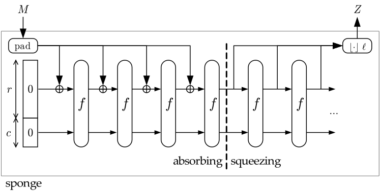
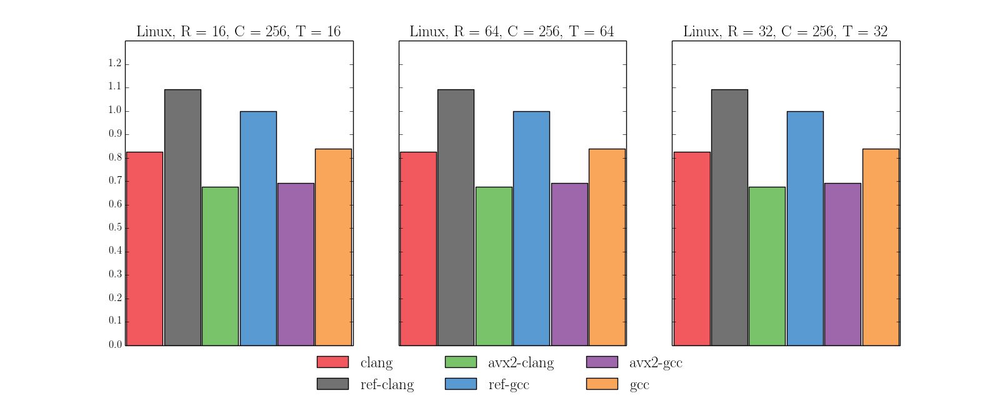

% Implementação da função Lyra2 para arquiteturas modernas
% Aluno: Guilherme P. Gonçalves; Orientador: Diego de Freitas Aranha
% Novembro de 2014

---
references:
  - id: lyra2-spec
    title: The Lyra2 reference guide
    author:
    - family: Simplicio Jr.
      given: Marcos A.
    - family: Almeida
      given: Leonardo C.
    - family: Andrade
      given: Ewerton R.
    - family: dos Santos
      given: Paulo C. F.
    - family: Barreto
      given: Paulo S. L. M.
    URL: http://www.lyra-kdf.net/Lyra2ReferenceGuide.pdf
    issued:
      year: 2014
  - id: sponge
    title: Cryptographic sponge functions
    author:
    - family: Bertoni
      given: Guido
    - family: Daemen
      given: Joan
    - family: Peeters
      given: Michaël
    - family: Van Assche
      given: Gilles
    issued:
      year: 2011
  - id: blake2b-avx2
    title: Implementing BLAKE with AVX, AVX2, and XOP
    author:
    - family: Neves
      given: Samuel
    - family: Aumasson
      given: Jean-Philippe
    issued:
      year: 2012
  - id: blake2b
    title: "BLAKE2: simpler, smaller, fast as MD5"
    author:
    - family: Neves
      given: Samuel
    - family: Aumasson
      given: Jean-Philippe
    - family: Wilcox-O'Hearn
      given: Zooko
    - family: Winnerlein
      given: Christian
    URL: https://blake2.net
    issued:
      year: 2013
---

\renewcommand{\figurename}{Figura}

# Introdução
A forma mais comum de autenticação de usuários em sistemas computacionais
atualmente é o uso de senhas. Nesse paradigma, o usuário é responsável por
escolher uma senha ao se registrar, que deve permanecer secreta, e o sistema
verifica, a cada acesso, se o usuário conhece a senha correta. Isso implica, é
claro, que a senha ficará armazenada no sistema de alguma forma.

Como medida de segurança, recomenda-se não armazenar a senha conforme fornecida
pelo usuário, mas sim um _hash_ dela, produzido por uma função de _hash_ de
senhas. O _hash_ é uma uma sequência pseudoaleatória de bits tal que, dado o
_hash_ $h$ de uma senha $s$, deve ser computacionalmente difícil descobrir
qualquer senha (incluindo $s$) cujo _hash_ também seja $h$ -- uma propriedade
conhecida como resistência ao cálculo de pré-imagem.

Assim, em um procedimento de autenticação moderno, o sistema computa o _hash_
da senha provida pelo usuário e o compara com o _hash_ que havia sido
armazenado para aquele usuário ao registrá-lo. Caso os _hashes_ sejam iguais, o
acesso é autorizado.

A partir disso, muitas técnicas foram introduzidas para dificultar ataques de
força-bruta -- aqueles em que um atacante faz tentativas sucessivas de
adivinhar uma senha -- sem onerar usuários exigindo que criem e memorizem
senhas longas e suficientemente entrópicas.

No campo das funções de _hash_ de senhas, isso significa a inclusão de
parâmetros de tempo e espaço de memória mínimos a serem utilizados pela
operação de _hash_. O parâmetro de tempo impõe um limite à velocidade com que
um atacante pode fazer tentativas sequenciais, enquanto o de espaço visa a
proteger contra ataques que empregam chips dedicados ou GPUs, caracterizados
pelo paralelismo mas escassez de memória.

Neste trabalho final de graduação, produzimos uma implementação da função de
_hash_ de senhas Lyra2, proposta por pesquisadores brasileiros e candidata ao
Password Hashing Competition, aproveitando conjuntos de instruções presentes
em arquiteturas modernas. Acredita-se que a Lyra2 possua as propriedades de
segurança exigidas de uma função de _hash_, e sua especificação inclui
parâmetros de espaço e tempo independentes a serem respeitados por uma
implementação correta.

A implementação resultante [^github] é compatível com a de referência e
competitiva com ela em termos de desempenho. Colaboramos ainda com o
desenvolvimento da especificação da Lyra2 [@lyra2-spec], na medida em que este
trabalho trouxe à tona diversas pequenas falhas e inconsistências no documento
e na implementação de referência.

[^github]: Disponível em <https://github.com/guilherme-pg/lyra2>

# Notação

Para o restante deste documento, os símbolos da primeira coluna da tabela
a seguir serão usados com o significado dado pela segunda coluna.

     Símbolo                    Significado
-----------------           -------------------
  $\oplus$                      XOR bit-a-bit
  $\lfloor \cdot \rfloor l$     Truncagem para $l$ bits
  $\ggg n$                      Rotação $n$ bits à direita
  $\boxplus$                    Adição sem carry entre palavras
  $||$                          Concatenação
  $len(n)$                      Tamanho em bytes de $n$
  $LSW(n)$                      Palavra menos significativa de $n$
  $rotRt(n)$                    Rotação $Rt$ bits à direita de $n$
  $rotRt^{m}(n)$                Rotação $m \cdot Rt$ bits à direita de $n$

# A função Lyra2

A Lyra2 se baseia na construção de esponja, uma forma geral para a geração de
funções de _hash_ seguras com entradas e saídas de tamanhos arbitrários a partir
de uma função de compressão e um esquema de _padding_.

De fato, o cálculo da Lyra2 para uma determinada entrada pode ser descrito em
alto nível como a aplicação iterada de operações de esponja, a serem descritas
a seguir, a dados mantidos em uma matriz de estado do algoritmo.
Consequentemente, conjectura-se que as propriedades de segurança da Lyra2
decorrem tanto da segurança da esponja subjacente, quanto da escolha criteriosa
de operações de esponja empregadas, que dificulta a paralelização do algoritmo.

## A construção de esponja

A definição canônica de uma esponja [@sponge] descreve sua operação em termos
de duas etapas -- _absorbing_ e _squeezing_ --, sendo que na primeira a esponja
incorpora a entrada a seu estado interno, e na segunda produz uma saída do
tamanho desejado baseada nesse estado. Assim, ao final de uma etapa de
_squeezing_, a esponja terá produzido um _hash_ pseudoaleatório de sua entrada,
e pode ser restaurada a seu estado original para uma aplicação posterior.

A Figura \ref{img-sponge} ilustra a construção de esponja.  Nela, a entrada $M$
é dividida em blocos após o _padding_ e absorvida para gerar a saída $Z$. $f$ é
uma função de compressão. A linha tracejada separa as etapas de _absorbing_
(esquerda) e _squeezing_ (direita), e o estado interno da esponja é dividido em
duas partes com tamanhos r (_rate_) e c (_capacity_)
bits.[^img-sponge-duplex-attribution]

Pode-se definir, ainda, uma construção similar à da esponja, denominada
_duplex_, em que se mantém o estado interno entre aplicações. Nela, as
operações de _absorb_ e _squeeze_ são substituídas por uma operação de
_duplexing_, na qual um bloco de entrada é absorvido e um bloco de saída é
imediatamente produzido. A Figura \ref{img-duplex} ilustra a construção de
_duplex_.[^img-sponge-duplex-attribution]

A Lyra2 utiliza uma versão modificada da construção de _duplex_, em que as
operações de _absorb_ e _squeeze_ também são suportadas, e podem ser efetuadas
independentemente.

[^img-sponge-duplex-attribution]: \textcopyright 2007-2013 Guido Bertoni, Joan
Daemen, Michaël Peeters and Gilles Van Assche / <http://sponge.noekeon.org/> /
CC-BY-3.0

## A função de compressão \label{sec-compression-fn}

Conforme visto anteriormente, a construção de esponja depende de uma função
$f$, denominada função de compressão. Para a esponja usada na Lyra2, a função
de compressão é uma versão levemente adaptada da função G que integra a função
de _hash_ BLAKE2b [@blake2b] . A função $G(a, b, c, d)$ utilizada é dada por:

\begin{align*}
\begin{split}
& a \leftarrow a + b \\
& d \leftarrow \left(d \oplus a \right) \ggg 32 \\
& c \leftarrow c + d \\
& b \leftarrow \left(b \oplus c \right) \ggg 24 \\
& a \leftarrow a + b \\
& d \leftarrow \left(d \oplus a \right) \ggg 16 \\
& c \leftarrow c + d \\
& b \leftarrow \left(b \oplus c \right) \ggg 63
\end{split}
\end{align*}

No contexto do algoritmo BLAKE2b, essa função é aplicada repetidamente a uma
matriz de estado $4 \times 4$ de inteiros de 64 bits, primeiramente aos
elementos de cada uma das colunas, depois aos de cada uma das diagonais. Essas
oito aplicações constituem uma _rodada_, e o algoritmo prevê transformações de
seu estado em conjuntos de 12 rodadas por vez.

Na Lyra2, o estado da esponja contém $128$ bytes e é visto como uma matriz de
estado linearizada, e as rodadas são definidas de forma análoga. No entanto, a
fim de melhorar o desempenho do algoritmo, a maior parte das compressões
efetuadas pela esponja não utiliza $\rho_{max} = 12$ rodadas, mas sim $\rho <
\rho_{max}$ (na prática, utiliza-se $\rho = 1$). Tais operações com apenas
$\rho$ rodadas são denominadas operações _reduzidas_ da esponja.

## O algoritmo Lyra2 \label{sec-lyra2-alg}

A Figura \ref{lyra2-alg} contém o pseudocódigo do algoritmo Lyra2 implementado
para este trabalho.

Basicamente, o algoritmo consiste de três etapas: _bootstrapping_, _setup_ e
_wandering_. Todas elas trabalham sobre uma matriz de estado de $R \times C$
blocos de $b$ bits, onde $R$ e $C$ são, portanto, parâmetros de espaço.

O tamanho dos blocos é definido de forma que possam ser absorvidos sem _padding_
pela esponja utilizada. Embora um bloco de $b = r$ bits pareça natural tendo em
vista as Figuras \ref{img-sponge} e \ref{img-duplex}, a especificação sugere
aumentar $r$ após a primeira absorção (linha 3 da Figura \ref{lyra2-alg}). Na
prática, tanto nosso código quanto o de referência utilizam um $r$ inicial de
$512$ bits, e utilizam posteriormente um novo $r = b = 768$ bits.

A fase de _bootstrapping_ inicializa a esponja com o vetor de inicialização da
função de compressão, e então absorve os parâmetros de entrada. A fase de
_setup_ inicializa a matriz de estado, e a fase de _wandering_ aplica operações
reduzidas de esponja a células pseudoaleatórias dessa matriz. Nessa fase, o
parâmetro $T$ controla o número de iterações a serem feitas, e, portanto, o
tempo utilizado.

O tempo total de execução do algoritmo é dado por $(T + 1) \cdot R \cdot C
\cdot \frac{\rho}{\rho_{max}}$ vezes o tempo de execução da função de
compressão da esponja, de forma que, ainda que o tempo de execução seja
limitado inferiormente pelos parâmetros de memória $R$ e $C$, ainda é possível
aumentá-lo mantendo o consumo de memória constante, através do parâmetro $T$.

# Descrição da implementação

Nossa implementação utiliza a linguagem C e possui duas variantes: uma
utilizando as instruções vetoriais do conjunto SSE2, e outra utilizando as do
conjunto AVX2.  Como o código de referência possui versões genérica (sem
instruções vetoriais) e SSE2, cabe clarificar que, para o restante deste
documento, e em particular na seção \ref{sec-experimental}, quaisquer menções a
nossa implementação ou à de referência se referem às respectivas versões SSE2
(a não ser, é claro, que nossa versão AVX2 esteja sendo discutida).

A versão SSE2 de nossa implementação, embora funcionalmente equivalente à de
referência, é baseada em decisões de design levemente diferentes. Além de
prezar pelo desempenho, nosso trabalho foi desenvolvido com particular cuidado
pela legibilidade, facilitando eventuais auditorias do código, e portabilidade,
evitando-se utilizar extensões específicas de determinados compiladores e
aderindo-se de forma bastante estrita ao padrão C99.

Uma diferença particularmente perceptível entre as implementações é que,
enquanto a de referência utiliza largamente _intrinsics_ para obter controle
fino sobre as instruções geradas, nossa implementação mantém os operadores de
alto nível da linguagem C e delega ao compilador a tarefa de emitir as
instruções vetoriais para a maior parte do código, à exceção da função de
compressão. Além do benefício em legibilidade, essa decisão tornou prático
emitir versões utilizando diferentes conjuntos de instruções usando o mesmo
código, e, conforme a seção \ref{sec-experimental}, não trouxe perda de
desempenho significativa.

O código utilizado para a função de compressão é o da implementação de
referência da BLAKE2b [^blake2b-ref-impl], com pequenas adaptações para remover
as constantes utilizadas durante aplicações da função G. No entanto, como essa
implementação da BLAKE2b não possui versão AVX2, foi necessário adaptá-la
conforme descrito na subseção \ref{avx2} para utilizadar esse conjunto de
instruções.

[^blake2b-ref-impl]: Disponível em <https://github.com/BLAKE2/BLAKE2>

O algoritmo Lyra2 apresentado na subseção \ref{sec-lyra2-alg} não especifica o
parâmetro $Rt$, que determina o tamanho em bits das rotações de blocos; a
implementação de referência, em sua versão SSE2, utiliza $Rt = 128$ bits, dado
que este é o tamanho de um vetor SSE2. Da mesma forma, nosso trabalho usa $Rt
= 128$ quando compilado com SSE2, e $Rt = 256$ em sua versão AVX2.

## A função de compressão em AVX2 \label{avx2}

Esta seção detalha as mudanças feitas na implementação de referência da função
de compressão da Lyra2 para aproveitar as instruções vetoriais do conjunto AVX2.

Conforme exposto na subseção \ref{sec-compression-fn}, a função de compressão da
Lyra2 consiste de $\rho$ rodadas da função G sobre uma matriz de estado $4
\times 4$ de $64$ bits. Assim, para uma matriz da forma:

\begin{align*}
\left(
\begin{matrix}
v_{0} & v_{1} & v_{2} & v_{3} \\
v_{4} & v_{5} & v_{6} & v_{7} \\
v_{8} & v_{9} & v_{10} & v_{11} \\
v_{12} & v_{13} & v_{14} & v_{15}
\end{matrix}
\right)
\end{align*}

uma rodada corresponde a:

\begin{align*}
\begin{matrix}
G(v_{0}, v_{4}, v_{8}, v_{12}) & G(v_{1}, v_{5}, v_{9}, v_{13}) & G(v_{2}, v_{6}, v_{10}, v_{14}) & G(v_{3}, v_{7}, v_{11}, v_{15}) \\
G(v_{0}, v_{5}, v_{10}, v_{15}) & G(v_{1}, v_{6}, v_{11}, v_{12}) & G(v_{2}, v_{7}, v_{8}, v_{13}) & G(v_{3}, v_{4}, v_{9}, v_{14})
\end{matrix}
\end{align*}

onde as aplicações em cada linha podem ocorrer em paralelo. No caso da Lyra2, o
estado da esponja possui $16 \times 64 = 1024$ bits e é interpretado como uma
matriz de estado linearizada em ordem de linhas para os propósitos da função de
compressão.

Na implementação vetorizada de referência da BLAKE2b, cada registrador vetorial
corresponde a mais de um inteiro de $64$ bits da matriz de estado -- por
exemplo, em uma implementação SSE2, $v_{0}$ e $v_{1}$ compartilham um
registrador de $128$ bits. Uma rodada consiste então em executar a função G
sobre as linhas da matriz em paralelo, rotacionar a i-ésima linha da matriz de
estado por i posições à esquerda, de forma que as antigas diagonais se tornem as
colunas, aplicar a função G sobre as (novas) colunas, e desfazer as rotações
[@blake2b-avx2]. O procedimento de rotação das linhas é chamado de
_diagonalização_.

Dessa forma, uma versão AVX2 da função de compressão pode utilizar as mesmas
técnicas que uma versão SSE2, adaptadas para o fato de que os registradores de
$256$ bits comportam uma linha inteira da matriz de estado por vez.
Especificamente, o código AVX2 produzido para este trabalho utiliza as novas
instruções `vpaddq` para as adições de $64$ bits, `vpxor` para as operações de
XOR, `vpshufd` e `vpshufd` para as rotações, e `vpermq` para as rotações de
linhas da matriz.

Em termos de código, nossa implementação AVX2 possui a mesma estrutura geral que
a de referência, apesar do uso de _intrinsics_ diferentes. A função G é dividida nas partes G1 e G2: G1 contém as
instruções até a rotação de 24 bits à direita, e G2 contém o restante da função.
G1 e G2 são implementadas conforme a listagem a seguir:

~~~{.C}
#define G1(row1,row2,row3,row4)        \
  row1 = _mm256_add_epi64(row1, row2); \
  row4 = _mm256_xor_si256(row4, row1); \
  row4 = _mm256_roti_epi64(row4, -32); \
  row3 = _mm256_add_epi64(row3, row4); \
  row2 = _mm256_xor_si256(row2, row3); \
  row2 = _mm256_roti_epi64(row2, -24);

#define G2(row1,row2,row3,row4)        \
  row1 = _mm256_add_epi64(row1, row2); \
  row4 = _mm256_xor_si256(row4, row1); \
  row4 = _mm256_roti_epi64(row4, -16); \
  row3 = _mm256_add_epi64(row3, row4); \
  row2 = _mm256_xor_si256(row2, row3); \
  row2 = _mm256_roti_epi64(row2, -63);
~~~

Cabe notar que, na listagem acima, `_mm256_roti_epi64`, responsável pelas
rotações, é a única primitiva que não é um _intrinsic_. Essa macro é definida
como:

~~~{.C}
#define r16_256 _mm256_setr_epi8(                               \
    2, 3, 4, 5, 6, 7, 0, 1, 10, 11, 12, 13, 14, 15, 8, 9, 18,   \
    19, 20, 21, 22, 23, 16, 17, 26, 27, 28, 29, 30, 31, 24, 25)
#define r24_256 _mm256_setr_epi8(                               \
    3, 4, 5, 6, 7, 0, 1, 2, 11,12, 13, 14, 15, 8, 9, 10, 19,    \
    20, 21, 22, 23, 16, 17, 18, 27, 28, 29, 30, 31, 24, 25, 26)
#define _mm256_roti_epi64(x, c)                                     \
    (-(c) == 32) ? _mm256_shuffle_epi32((x), _MM_SHUFFLE(2,3,0,1))  \
    : (-(c) == 24) ? _mm256_shuffle_epi8((x), r24_256)              \
    : (-(c) == 16) ? _mm256_shuffle_epi8((x), r16_256)              \
    : (-(c) == 63) ? _mm256_xor_si256(_mm256_srli_epi64((x), -(c)), \
                                      _mm256_add_epi64((x), (x)))   \
    : _mm256_xor_si256(_mm256_srli_epi64((x), -(c)),                \
                       _mm256_slli_epi64((x), 64-(-(c))))
~~~

A diagonalização e sua inversa são implementadas com o _intrinsic_ `_mm256_permute4x64_epi64`:

~~~{.C}
#define DIAGONALIZE(row1, row2, row3, row4)                    \
  row2 = _mm256_permute4x64_epi64(row2, _MM_SHUFFLE(0,3,2,1)); \
  row3 = _mm256_permute4x64_epi64(row3, _MM_SHUFFLE(1,0,3,2)); \
  row4 = _mm256_permute4x64_epi64(row4, _MM_SHUFFLE(2,1,0,3));

#define UNDIAGONALIZE(row1, row2, row3, row4)                  \
  row2 = _mm256_permute4x64_epi64(row2, _MM_SHUFFLE(2,1,0,3)); \
  row3 = _mm256_permute4x64_epi64(row3, _MM_SHUFFLE(1,0,3,2)); \
  row4 = _mm256_permute4x64_epi64(row4, _MM_SHUFFLE(0,3,2,1));
~~~

E, assim, uma rodada é definida como:

~~~{.C}
#define BLAKE2B_ROUND(v)                 \
  G1(v[0], v[1], v[2], v[3]);            \
  G2(v[0], v[1], v[2], v[3]);            \
  DIAGONALIZE(v[0], v[1], v[2], v[3]);   \
  G1(v[0], v[1], v[2], v[3]);            \
  G2(v[0], v[1], v[2], v[3]);            \
  UNDIAGONALIZE(v[0], v[1], v[2], v[3]);
~~~

onde o parâmetro `v` é uma matriz de estado linearizada, de forma que `v[i]` é
um `__m256i` contendo a i-ésima linha.

Além dessas adaptações na função de compressão, as únicas mudanças não-triviais
feitas no restante do código de nossa implementação para habilitar nela o uso de
AVX2 dizem respeito aos requerimentos de alinhamento de memória nos operandos
das novas instruções.

# Resultados experimentais \label{sec-experimental}

Esta seção apresenta os resultados de uma comparação de desempenho entre
diferentes implementações da função Lyra2. Os testes foram conduzidos em dois
ambientes diferentes: um Macbook Pro Retina modelo Mid-2012 rodando o sistema
operacional OSX na versão 10.10.1, com um processador Intel Core i7-3720QM
(família Ivy Bridge) e 16 GiB de memória, e um desktop com processador Intel
Core i7-4770 (família Haswell) e 8GiB de memória rodando a distribuição Linux
Fedora 18. O recurso TurboBoost, que aumenta dinamicamente a frequência do
processador, foi desativado em ambas as máquinas.

A metodologia utilizada consistiu em executar cada implementação $1000$ vezes
com as mesmas entradas e extraindo-se uma senha de $64$ bytes, para três
conjuntos de parâmetros $R$ e $T$ do algoritmo Lyra2. O parâmetro $C$ foi
deixado fixo em $256$, o valor sugerido pela implementação de referência. A
mediana dos tempos levados nessas $1000$ execuções foi tomada como métrica final
de desempenho, para cada conjunto de parâmetros. Os processos foram executados
usando _niceness_ zero, o padrão em ambos os sistemas.

Para cada um dos códigos, foram testados os binários gerados pelos
compiladores clang e gcc, nas respectivas versões 3.4.2 e 4.9.0. No entanto,
devido ao limitado suporte ao gcc no sistema OSX, apenas medições com clang
foram feitas nessa plataforma. Essas medições visam a avaliar o impacto de
delegar a maior parte das escolhas de instruções para o compilador em nosso
código, indo de encontro à abordagem da implementação de referência, que se
baseia fortemente no uso explícito de _intrinsics_.

A Figura \ref{results-linux} ilustra os resultados experimentais obtidos no
ambiente Linux. Nela, os nomes _ref-gcc_ e _ref-clang_ correspondem à
implementação de referência compilada, respectivamente, com gcc e clang. Os
nomes _gcc_ e _clang_ são análogos, mas referem-se à implementação proposta
neste trabalho. Finalmente, _avx2-clang_ e _avx2-gcc_ correspondem à variante
que utiliza as instruções AVX2, descrita na subseção \ref{avx2}, novamente
usando os dois compiladores analisados. Os tempos de execução foram
normalizados pelo da medição _ref-gcc_ para cada conjunto de parâmetros.

As versões AVX2, conforme esperado, tiveram desempenho melhor do que as demais.
Nelas, o compilador utilizado não trouxe diferença significativa (_avx2-clang_
foi apenas cerca de $3\%$ mais rápida do que _avx2-gcc_ em todos os testes), e
ambas foram cerca de $30\%$ mais rápidas do que _ref-gcc_ em todos os testes.

Para as demais versões, a escolha do compilador influiu sensivelmente no
desempenho observado, mas não apenas para nossa implementação: considerando os
três conjuntos de parâmetros, a maior variação observada foi entre _ref-clang_
e _ref-gcc_ para $R = T = 16$, em que a primeira foi $8.95\%$ mais lenta ($1947
\mu s$ contra $1787 \mu s$). De fato, para todos os conjuntos de parâmetros, as
versões _ref-clang_ foram cerca de $8\%$ mais lentas do que as _ref-gcc_, e as
versões _gcc_ foram $8\%$ _mais lentas_ do que as _clang_. Entre as versões sem
AVX2, _clang_ foi a mais rápida para todas as configurações, mas por apenas
cerca de $1.5\%$ do tempo de _ref-gcc_, uma diferença pouco expressiva.

A Figura \ref{results-osx} mostra os resultados dos mesmos testes executados na
máquina rodando OSX. Como nela não há suporte ao conjunto de instruções AVX2,
não foi possível avaliar _avx2-clang_ nessa plataforma.

Aqui registrou-se significativa diferença de desempenho entre os binários, com
_clang_ sendo cerca de $18\%$ mais rápida do que a implementação de referência,
em todos os testes.

Dado que nossa implementação foi desenvolvida no ambiente com OSX e clang, e a
de referência foi produzida em ambiente Linux com gcc, pode-se dizer que as
diferenças de desempenho entre compiladores refletem a maior exposição de cada
implementação à plataforma em que foi escrita.

# Conclusão

Este trabalho produziu uma implementação de uma nova função de _hash_ de senhas
tomando proveito de arquiteturas e compiladores modernos. Nossa implementação é
compatível e competitiva com a de referência, tendo-se obtido significativa
melhora de desempenho com o uso conjunto de instruções AVX2, e seu
desenvolvimento contribuiu com a evolução da especificação.

# Referências bibliográficas
